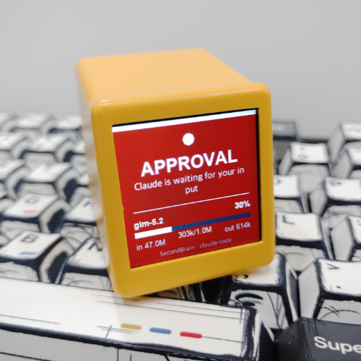
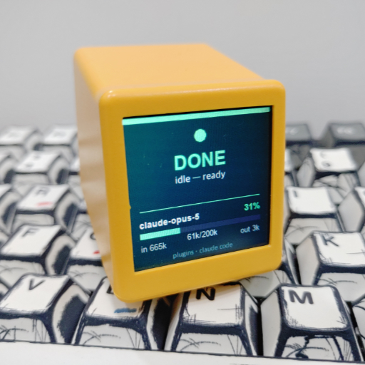

<!-- Translated from README.md @ commit 58cc9a2 (2026-07-29) -->
<!-- If English README has changed since then, this translation may be outdated -->

> This is a translation of [README.md](../../../README.md).
> The English version is the authoritative source and may be more up-to-date.

[English](../../../README.md) | [한국어](../ko/README.md) | [日本語](../ja/README.md) | **[简体中文](README.md)** | [繁體中文](../zh-Hant/README.md) | [Español](../es/README.md) | [Français](../fr/README.md) | [Deutsch](../de/README.md) | [Português](../pt/README.md) | [Русский](../ru/README.md) | [Italiano](../it/README.md)

<div align="center">

<h1>Agent Glance</h1>
</div>

> 把 **GeekMagic SmallTV** 变成一块实时的智能体状态显示屏 —— 适用于 Claude Code、Codex 和 agy。

这块小屏幕会实时显示你的智能体正在做什么:**WORKING**、**APPROVAL NEEDED**、**DONE** —— 还会显示从实时会话记录中读取的模型、上下文窗口占用率和 token 数量。
最亮眼的功能是红色的 **APPROVAL** 屏幕:把它放在另一块显示器上,你就可以走开去做别的事,回头瞥一眼就能立刻知道它是否卡在等你确认,而不是十分钟后才发现。

| Event | Display |
|---|---|
| prompt submitted | ● **WORKING**(琥珀色)+ 提示词 |
| approval needed | ⛔ **APPROVAL**(红色)+ 需要确认的内容 |
| turn finished | ✓ **DONE**(绿色) |

每一帧还会带上 `model · context bar + % · in/out tokens`。

<div align="center">
<table width="100%">
<tr>
<td width="50%"></td>
<td width="50%"></td>
</tr>
</table>
</div>

## 环境要求

- 运行 **SD_RU / SD Pro** 社区固件(ESP8266)的 GeekMagic SmallTV。快速验证方法 —— 以下命令必须返回包含 `files` 数组的 JSON:

  ```bash
  curl -s http://<DEVICE_IP>/photo/list
  ```
  
  GeekMagic 官方固件以及 ESP32 版的 "PRO" 使用 *不同* 的 API,**不受支持**。
  
- 设备需与本机连接同一个 Wi-Fi。
- Python 3.8+ 并安装 Pillow(`pip install Pillow`)。

## 安装

通过 [`epicsagas/plugins`](https://github.com/epicsagas/plugins) 市场发布,插件本体位于 [`epicsagas/AgentGlance`](https://github.com/epicsagas/AgentGlance)。

**Claude Code**

```bash
claude plugin marketplace add epicsagas/plugins
claude plugin install agent-glance@epicsagas
```

**Codex**

```bash
codex plugin marketplace add epicsagas/plugins
codex plugin add agent-glance@epicsagas
```

**agy (Antigravity)**

```bash
agy plugin install https://github.com/epicsagas/AgentGlance
```

**hermes**

```bash
hermes plugins install epicsagas/AgentGlance
hermes plugins enable agent-glance
```

### 各宿主平台的支持情况

| Host | Skills | Slash commands | Auto hooks | Status |
|---|:--:|:--:|:--:|---|
| Claude Code | ✅ | ✅ | ✅ | 已完成端到端验证 |
| Codex | ✅ | ✅ | ✅ | 钩子文件与文档化的 schema 一致;尚未做运行时验证 |
| agy | ✅ | — | ✅ | 钩子格式与一个实际安装的 agy 插件一致;尚未做运行时验证 |
| hermes | ✅ | — | ❌ | 仅支持 skills —— hermes 只通过 `register(ctx)` 注册,没有接入生命周期钩子 |

接下来完成设备上线 —— 这会找到设备、保存 IP、备份设备,并切换到监视器模式:

```
/agent-glance:setup
```

在不支持斜杠命令的宿主上,手动执行相同的步骤:

```bash
python3 <plugin>/scripts/agent_glance.py --ip <DEVICE_IP>
python3 <plugin>/scripts/agent_glance.py --setup
```

钩子随插件一起提供,会自行启用。**安装后请重启智能体** —— 钩子是在会话启动时加载的。

## 配置

配置**优先读取环境变量**,若不存在则回退到 `~/.agent-glance/config.json`(由 `--ip` 写入)。对于共享或多机环境,环境变量是更具可移植性的选择。

| Variable | Purpose | Default |
|---|---|---|
| `AGENT_GLANCE_IP` | 设备 IP —— **必填** | — |
| `AGENT_GLANCE_CONTEXT_LIMIT` | 用于缩放百分比条的上下文窗口大小 | `200000` |

## 命令

| Command | What it does |
|---|---|
| `/agent-glance:setup` | 完整上线流程 —— 发现设备、验证固件、保存 IP、备份、接管控制 |
| `/agent-glance:status` | 健康检查 —— 可达性、当前主题、重复钩子、错误日志 |
| `/agent-glance:test` | 推送一帧(或依次循环三种状态)以检查渲染效果 |
| `/agent-glance:restore` | 把设备恢复到原来的时钟和照片状态 |

## 工作原理

该固件**没有文本 API**,所以根本没有可以"打印"的对象。脚本会改为用 Pillow 渲染一张 240×240 的 GIF,推送到设备的 Photo 相册中,并把这张图片设为唯一启用的照片、Photo 设为唯一启用的主题 —— 这样画面就会固定不变,不会被轮换掉。

```
host lifecycle hook (JSON on stdin)
        │
   scripts/agent_glance.py
     · normalises the payload  (hook_event_name | hookEventName)
     · maps the host's event to WORKING / APPROVAL / DONE
     · reads the session transcript for model / context / tokens
     · renders a 240×240 GIF (CJK-safe font fallback)
     · forks the upload so the agent never waits on the device
        │
   SmallTV photo album  →  display
```

## 多宿主钩子

三个宿主平台**并不共用**同一套钩子格式,因此各自使用独立的文件。之所以刻意不放置通用的 `hooks/hooks.json`,是因为该路径同时是 Claude Code 和 Codex 的默认路径,留在那里会导致错误的宿主加载它。

| Host | Hook file | Why there |
|---|---|---|
| Claude Code | `.claude-plugin/hooks.json` | 在 `.claude-plugin/plugin.json` 中声明 |
| Codex | `.codex-plugin/hooks.json` | 在 `.codex-plugin/plugin.json` 中声明 |
| agy | `hooks.json`(插件**根目录**) | 被迫如此 —— agy 的 manifest schema 是 `additionalProperties:false`,无法单独声明路径 |

由于各宿主的生命周期不同,对应的事件也不同:

| Display | Claude Code | Codex | agy |
|---|---|---|---|
| ● WORKING | `UserPromptSubmit` | `UserPromptSubmit` | `PreInvocation` |
| ⛔ APPROVAL | `Notification` | `PermissionRequest` | `PreToolUse` matcher `ask_permission` |
| ✓ DONE | `Stop` | `Stop` | `Stop` |

负载数据也不同:Claude Code 和 Codex 发送 `hook_event_name` / `transcript_path`(snake_case),agy 发送 `hookEventName` / `transcriptPath`(camelCase),并把配置包在一个带名字的钩子组里。脚本会把这些全部标准化。

只有 Claude Code 会在钩子命令中替换 `${CLAUDE_PLUGIN_ROOT}`,因此另外两个宿主直接引用各自已安装的插件路径:

```
claude  ${CLAUDE_PLUGIN_ROOT}/scripts/agent_glance.py
agy     $HOME/.gemini/config/plugins/agent-glance/scripts/agent_glance.py
codex   $HOME/.codex/plugins/cache/epicsagas/AgentGlance/<version>/scripts/agent_glance.py
        (resolved at hook time — Claude Code and Codex both install into
         versioned directories; agy does not)
```

## 设备 API 参考(SD_RU / SD Pro)

| Action | Endpoint |
|---|---|
| upload image | `POST /photo/upload` (multipart field `file`) |
| photo on/off | `GET /photo/toggle?name=<f>&state=1\|0` |
| delete photo | `GET /photo/delete?name=<f>` |
| theme on/off | `GET /theme/toggle?id=<n>&state=1\|0` (id 2 = Photo) |
| read state | `GET /photo/list`, `/theme/list`, `/config` |

在实机上探测得到的坑:

- `state` 必须是 `1` / `0`。固件对它执行 `atoi()`,所以 `"true"` 会变成 `0`,悄无声息地做出与预期相反的动作。
- 关闭**最后一个**启用中的主题或照片会返回 **HTTP 403** —— 这是防止黑屏的保护机制。设置流程会先启用目标对象,再禁用其余的。
- ESP8266 是单线程的,处理前一个请求时会返回 403,所以上传会重试。
- ⚠️ `/config` 会在没有任何鉴权的情况下,以**明文**提供设备的 Wi-Fi 密码和天气 API 密钥。这是固件本身的行为,并非本插件新增的问题 —— 但在共享网络中,应将该设备视为不可信的。

## 局限性

- **7 个设备主题无法各自显示一个会话。** 只有 Photo 主题能渲染自定义内容,其余六个都是固定的时钟/天气界面。要轮流显示多个会话,就需要在相册里放多张图片 —— 目前尚未实现。
- 指标数据取自 Claude Code 的会话记录格式。在 Codex/agy 下状态颜色仍然可用,但模型/token 字段可能为空。
- 状态(`config.json`、`device_backup.json`)保存在 `~/.agent-glance/` 而非插件目录下,插件更新时也不会被清除。

## 许可证

[MIT](../../../LICENSE)
